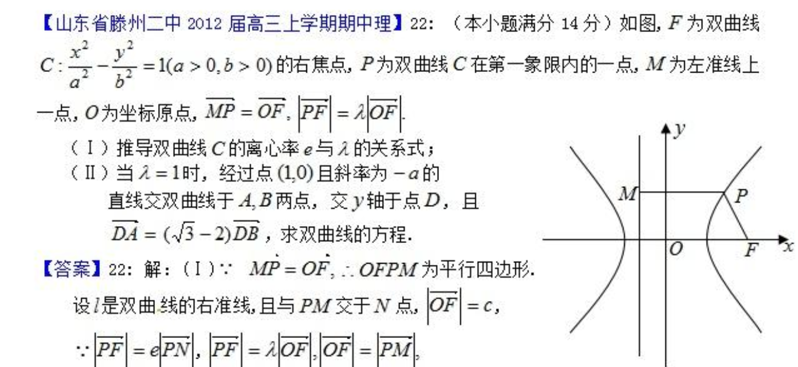

# case_001

在本目录的 `question.txt` 写入题目或讲解需求。

`question.txt` 支持图片引用（发给 LLM1）：

```txt
已知如图，求粒子轨迹半径。
图片: ./assets/q1.png
```

或 Markdown 写法：

```txt
请讲解这道题并给出推导。

```

## 一键完整流程（推荐）

在仓库根目录执行：

```powershell
python Manim4Teach/pipeline/runners/run_case.py --case-dir Manim4Teach/cases/case_001
```

`case_001` 还是默认 case，所以最短可直接：

```powershell
python Manim4Teach/pipeline/runners/run_case.py
```

## 分步运行（LLM1 -> LLM2）

### Step 1: 先跑 LLM1 生成 analysis_packet（默认 Claude）

```powershell
python Manim4Teach/pipeline/runners/run_stage1_analysis_packet.py `
  --requirement-file Manim4Teach/cases/case_001/question.txt `
  --out-dir Manim4Teach/cases/case_001/llm1
```

### Step 2: 再跑 LLM2 生成并迭代 scene.py（默认 Claude）

```powershell
python Manim4Teach/pipeline/runners/run_llm2_loop.py `
  --analysis-packet Manim4Teach/cases/case_001/llm1/stage1_analysis_packet.json `
  --requirement-file Manim4Teach/cases/case_001/question.txt `
  --out-dir Manim4Teach/cases/case_001/llm2
```

## 可选参数（只在需要时加）

```powershell
python Manim4Teach/pipeline/runners/run_case.py `
  --case-dir Manim4Teach/cases/case_001 `
  --max-rounds 4 `
  --skip-preview
```

## 可选：开启 VLM 观感评审

先在 `Manim4Teach/.env` 增加：

```dotenv
M4T_ENABLE_VLM=1
M4T_VLM_MAX_IMAGES=3
```

然后照常运行上面的命令即可。

## 主要输出

- `llm1/stage1_analysis_packet.json`
- `llm1/stage1_analysis_packet_raw.txt`
- `llm2/final/scene.py`
- `llm2/final/vlm_review.json`
- `llm2/final/preview.mp4`（若未 `--skip-preview`）
- `llm2/final/meta.json`（本次结果摘要）
